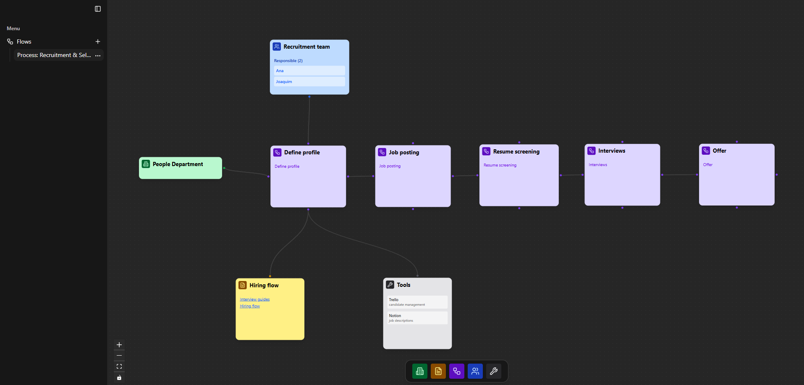

<h1 align="center" style="font-size: 64px">
  Process Flow
</h1>

<p align="center">is a tool to map and visualize company processes, subprocesses, tools, and responsibilities in an interactive way. </p>

<p align="center">
   
  <a href="https://github.com/tthheusalmeida/process-flow-front/">
    
  </a>
  <a href="https://github.com/tthheusalmeida/process-flow-front/blob/main/LICENSE">
    
  </a>
</p>

# 🗂️ Table of Contents

- [About](#about)
- [How To Use](#how-to-use)
- [Scenario](#scenario)
- [Technologies](#technologies)
- [Architecture](#architecture)
- [Entities](#entities)

---

<a id="about"></a>

## 📚 About

**Process Flow** was built to solve a common challenge in growing companies: the lack of clear documentation and visualization of internal processes.  
The platform allows mapping of **departments, processes, subprocesses, tools, documents, and responsible people**, with a visual representation of the workflow.

Key features:

- 📌 Register **areas/departments** and associate them with processes.
- 🧩 Create **processes** with unlimited levels of subprocesses.
- 🔗 Define relationships between department, processes, documents, owners, and tools.
- 📑 Attach department, documents, owners, and tools used in each process.
- 🕹️ Visualize the process hierarchy in an **interactive graph** using drag-and-drop.
- 🎨 Custom visual representation with icons, colors, and hierarchy levels.

---

<a id="how-to-use"></a>

## ⚙️ How to Use

Clone the project:

```
git clone https://github.com/tthheusalmeida/process-flow-front.git
```

Install the dependencies:

```
npm install
```

Create a `.env` file in the root of the project with example environment variables:

```.env
NEXT_PUBLIC_BASE_URL=http://localhost:8080
```

Run code:

```
npm run start
```

> Note: You must run backend together!

<a id="scenario"></a>

## 🏢 Scenario

The project addresses the following **business problem**:

> Growing companies often face disorganized internal processes and lack of proper documentation, making it hard to identify workflows, tools in use, responsibilities, and dependencies.

**Process Flow** solves this by providing a platform where companies can:

- Organize processes hierarchically.
- Clearly document dependencies, responsibilities, and resources.
- Visualize the entire process structure in an intuitive, graphical way.

Example: **People Department**

- **Process: Recruitment & Selection**
  - Subprocesses: Define profile, Job posting, Resume screening, Interviews, Offer.
  - Tools: Trello (candidate management), Notion (job descriptions).
  - Owners: Recruitment team.
  - Docs: Hiring flow, interview guides.



---

<a id="technologies"></a>

## 🚀 Technologies

### **Frontend**

- [React 19](https://react.dev/)
- [Next.js 15](https://nextjs.org/)
- [TailwindCSS 4](https://tailwindcss.com/)
- [SWR](https://swr.vercel.app/)
- [Shadcn](https://ui.shadcn.com/docs/installation/next) components (Dialog, Dropdown, Tooltip, etc.)
- [Lucide React](https://lucide.dev/) (icons)
- [React Flow](https://xyflow.com/) (graph visualization library)

### **Backend** [->](https://github.com/tthheusalmeida/process-flow-back)

> Note: This code should run together with the backend

---

<a id="architecture"></a>

## 🏗️ Architecture

The system is structured in three layers: **Frontend**, **Backend (external API)**, and **Database**.

- **Frontend (Next.js + React Flow + TailwindCSS)**

  - Handles UI, drag-and-drop graph, and interactive navigation.
  - Uses SWR for fetching backend data.
  - Shadcn UI for accessible components (modals, dropdowns, tooltips).

- **Backend ([separate repository](https://github.com/tthheusalmeida/process-flow-back))**

  - Provides REST endpoints for processes, processes, documents, tools, and owners.
  - Manages business logic and persistence in memory.

- **Database**
  - There is no database, since this is a study case.

---

<a id="entities"></a>

## 🧩 Entities

- **Flow** → Metadata container for assembling the full graph.
- **Node** → Represents one of the following types:
  - `Department`
  - `Document`
  - `Process`
  - `Owner`
  - `Tool`
- **Edge** → Connection between nodes.

### Rules of relationships

- A **Process** can connect to any node (including another Process).
- **Department**, **Document**, **Owner**, and **Tool** always connect to a **Process**.

---

## 📝 License

This project is under the MIT license.  
See the [license page](https://opensource.org/licenses/MIT) for more details.
